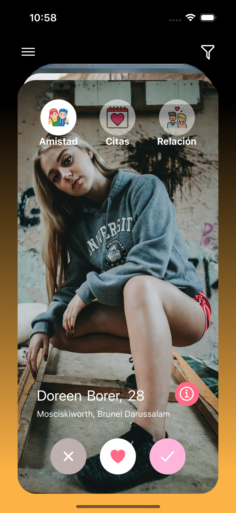
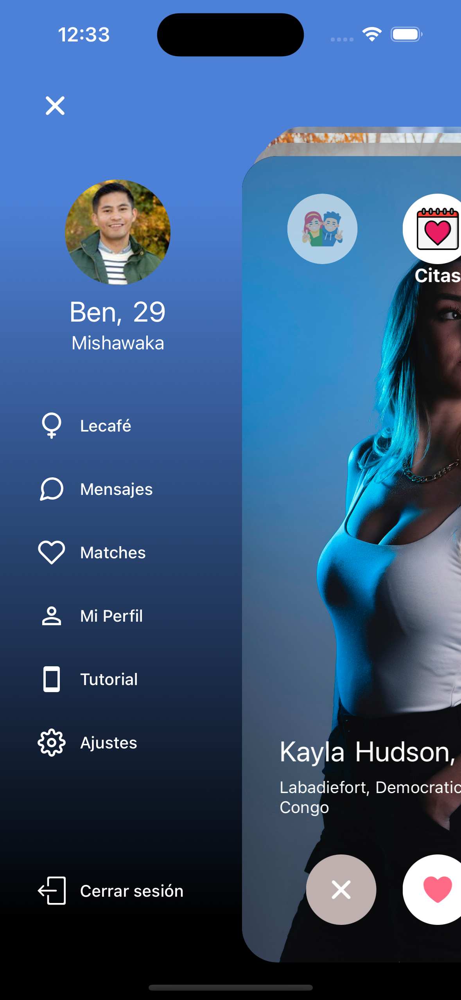
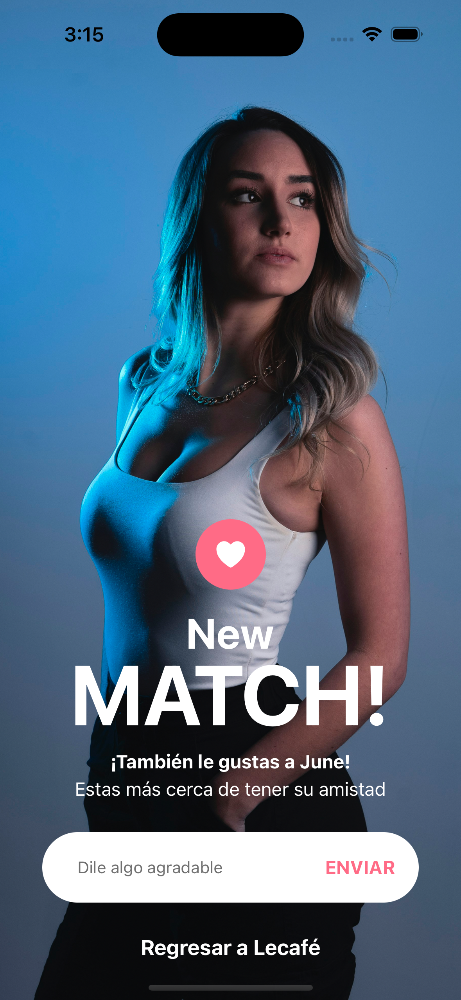
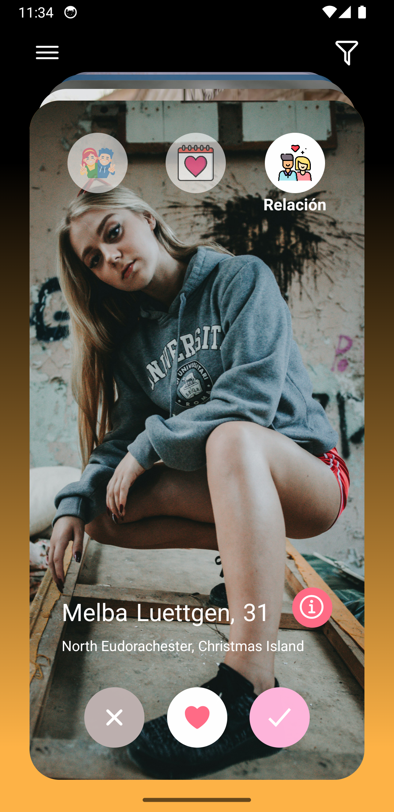
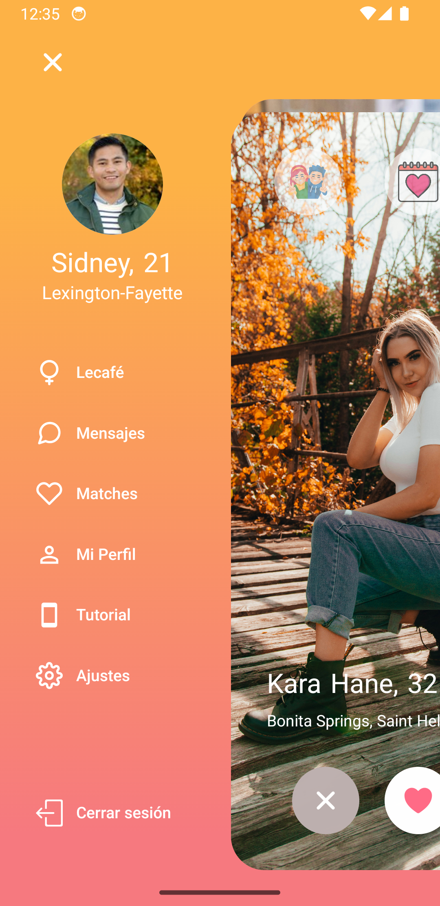
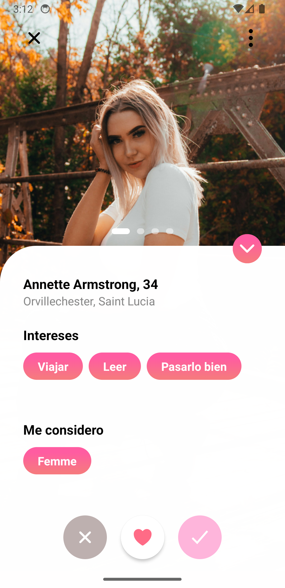

# React Native Take Home Test - 2025
### React Native Dating App Clone with Tinder-like UI

<h2 align="center">iOS</h2>

<table align="center">
  <tr>
  <td></td>
    <td width="25"></td>
    <td></td>
    <td width="25"></td>
    <td></td>
  </tr>
</table>

<h2 align="center">Android</h2>

<table align="center">
  <tr>
  <td></td>
    <td width="25"></td>
    <td></td>
    <td width="25"></td>
    <td></td>
  </tr>
</table>

## Tech Stack
- React Native (0.79.2)
- Expo SDK (53.0.9)
- TypeScript
- Bun (Package Manager)
- Styled Components
- Expo Router
- React Navigation (Drawer)
- React Native Reanimated
- Jest & React Native Testing Library
- Biome (Formatting & Linting)
## Prerequisites
### Required Software
- [Node](https://nodejs.org/es) (18.x or higher, I'm using v18.17.1 )
- [Bun](https://bun.sh/) ( I'm using v1.2.9 )
- [Expo Go (for testing on physical devices)](https://expo.dev/go?sdkVersion=51&platform=android&device=true)
- [Xcode (for iOS development)](https://developer.apple.com/documentation/safari-developer-tools/installing-xcode-and-simulators)
- [Android Studio (for Android development)](https://developer.android.com/studio)
- iOS Simulator or Android Emulator
## Installation Guide
### 1. Environment Setup

[Install NVM (Node Version Manager)](https://github.com/nvm-sh/nvm?tab=readme-ov-file#installing-and-updating):

```
# Using nvm (recommended)
curl -o- https://raw.githubusercontent.com/nvm-sh/nvm/v0.40.3/install.sh | bash

# Restart your terminal and install Node.js
nvm install 18.17.1
nvm use 18.17.1

# Verify installation
node --version
```

Install Bun 

For more detailed installation instructions (npm , homebrew, etc) and troubleshooting, visit the Bun [Installation Guide](https://bun.sh/docs/installation)

(macOS & Linux):

```
# for macOS, Linux
curl -fsSL https://bun.sh/install | bash -s "bun-v1.2.9"
```

### 2. Project Setup
Clone and install:

```
git clone https://github.com/AndreSubia/tinder-clone.git
cd tinder-clone
bun install
```
### 3. Running the Application
```
# Start the development server
bun start

# Run on iOS simulator
bun ios

# Run on Android emulator
bun android
```
## Development Scripts
```
# Format code
bun format

# Lint code
bun lint

# Type checking
bun check
```
## Project Structure
```
tinder-clone/
├── src/
   ├── components/
   │   ├── atoms/
   │   ├── molecules/
   │   └── organisms/
   ├── data/
   ├── providers/
   ├── screens/
   ├── styles/
   └── types/
```
## Key Features
- Atomic Design Pattern
- Gesture Handling
- Smooth Animations
- Type-Safe Development
- Unit Testing
- Code Quality Tools
## Testing
The project uses Jest and React Native Testing Library for unit testing. Tests can be run using:

```
bun run test
```
## Code Quality
- Biome for formatting and linting
- TypeScript for type safety
- Pre-commit hooks with Lefthook
- Consistent code style enforcement
## Troubleshooting
### Common Issues
1. Metro Bundler Issues
```
# Clear Metro cache
bun start --clear
```
2. Dependencies Issues
```
# Clean install dependencies
bun install --force
```
### Development Tips
- Use Expo Go app for testing on physical devices
- Enable Hot Reloading for faster development
- Check Expo documentation for specific version compatibility
## Additional Resources
- [Expo Documentation](https://docs.expo.dev/guides/using-bun/)
- [React Native Documentation](https://reactnative.dev/docs/environment-setup)
## Support
For any issues or questions, please open an issue in the repository.